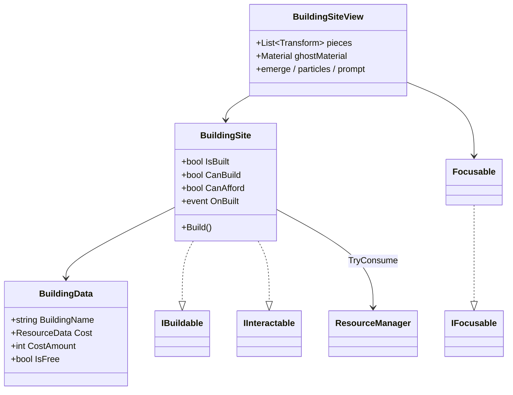

# Building — system spec

A place where the player builds a structure that costs resources. Data + logic + presentation in three layers, plus a deprecated L4 "simple" chain kept around so the L4 scene still opens.

## What's here

- **BuildingData** (SO) — building identity + single resource cost. `IsFree` when no cost wired.
- **BuildingSite** — guards, consumes cost via `ResourceManager.TryConsume`, fires `OnBuilt`. Implements `IInteractable` as a **tap** verb (single key-down completes immediately).
- **BuildingSiteView** — visual feedback. Pre-placed pieces are hidden at Start, ghost clones appear on focus, real pieces emerge from below on build. Requires sibling `BuildingSite` + `Focusable`.
- **IBuildable** — verb-data contract used by UI / listeners (separate from `IInteractable` so the player flow stays verb-agnostic).
- **`_Simple` siblings (deprecated)** — L4 flow with proximity sensor + spawned prefab. Remove when the L4 scene is retired.

## Lifetime / wiring

- One `BuildingSite` per build location. Owns its `BuildingData` reference.
- `ResourceManager` singleton must exist in the scene; missing manager = build silently no-ops.
- Site's collider must be on a layer included in the player's `RaycastSensor` mask.

## Why

- **No prefab on `BuildingData`** — pieces are scene-authored so each site can place its building uniquely. Data only describes identity + cost.
- **Single cost (not multi) for now.** A future extension to `List<ResourceCost>` is noted in `BuildingData.cs`. Not blocking until the design needs "5 wood + 2 stone".
- **Tap interaction** — instant build feels right for the current verb. Contrasts with `Harvestable`, which is a hold verb (`IHoldInteractable`). The shared `IInteractable` base lets `PlayerInteractor` dispatch both with one lookup.
- **View ≠ Logic.** `BuildingSite` knows nothing about ghosts, particles, or text. The view subscribes to `OnBuilt` and `Focusable` events. Either layer can change without touching the other.
