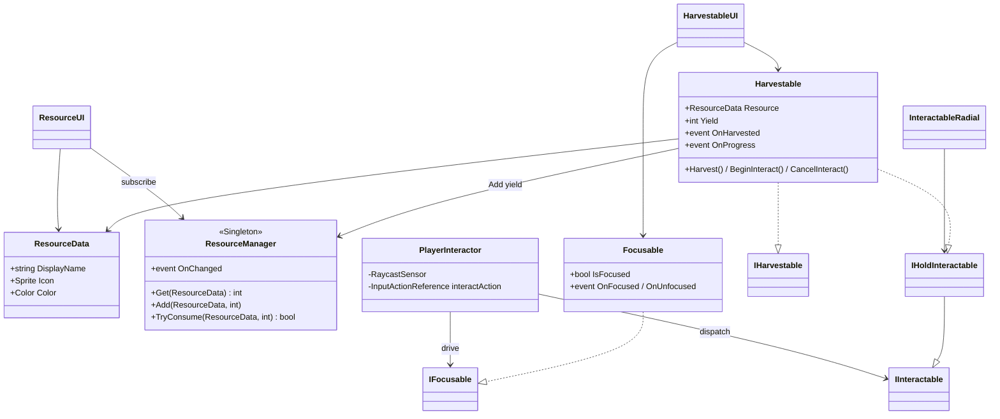

# Resource — system spec

Resource economy + the player's interaction layer. Resources are SO types harvested from world objects, deposited in a singleton stockpile, displayed in a HUD. Player input is brokered through small interface contracts so any future verb plugs in the same way.

## What's here

- **ResourceData** (SO) — Wood / Stone / Food. Display name, icon, color. Flyweight: one asset, many references.
- **ResourceManager** (singleton) — `Dictionary<ResourceData, int>` stockpile. `Add` / `TryConsume` mutate; `OnChanged(resource, newAmount, delta)` event.
- **Harvestable** — yields a `ResourceData` on completion. Implements `IHarvestable` (instant action for NPCs / scripts) AND `IHoldInteractable` (player drives via held progress, cancel on release / look-away).
- **Focusable** — tracks "is the player looking at me right now?" Fires `OnFocused` / `OnUnfocused` for any presentation layer to react.
- **PlayerInteractor** — raycasts forward, drives `IFocusable` transitions, dispatches the interact key through `IInteractable` (tap verbs complete on key-down; `IHoldInteractable` verbs additionally tick until release / look-away).
- **HarvestableUI** — world-space prompt; visible while focused, hidden on harvest.
- **InteractableRadial** — generic UI radial-fill bound to any sibling `IHoldInteractable.OnProgress`. Verb-agnostic — works for hold harvest today, hold-to-light-beacon tomorrow. Drops onto tap-only verbs harmlessly (does nothing).
- **ResourceUI** — HUD rows, one per tracked `ResourceData`. Subscribes to `ResourceManager.OnChanged`, never writes.

## Lifetime / wiring

- One `ResourceManager` per scene. Found via static `Instance` — no inspector wiring needed.
- `Harvestable` typically siblings with `Focusable` + `HarvestableUI` + `InteractableRadial` on the same GameObject; collider on a layer the player's `RaycastSensor` includes.
- `ResourceUI` lives on a screen-space Canvas; `HarvestableUI` lives on per-object world-space Canvases.

## Why

- **Singleton** because every harvester / cost-checker / HUD row needs to find the manager without designer wiring. Tradeoff: hidden global; mitigated by keeping the surface tiny.
- **Dictionary keyed by SO reference** — adding a new resource type is creating an asset, no code changes.
- **Two interfaces split by concern.** `IHarvestable` = "what gets harvested" (read by NPCs / scripts). `IHoldInteractable` = "how the player drives this verb" (read by `PlayerInteractor`). Same component, two callers, no one drags in members they don't use. Interface Segregation in practice.
- **Dispatch split into tap vs hold.** `IInteractable` is the minimal tap contract; `IHoldInteractable : IInteractable` adds `Duration` / `OnProgress` / `CancelInteract`. Tap verbs (BuildingSite, Activatable, Toggleable, Grabbable) carry no dead "hold" fields; hold verbs (Harvestable, HoldGrabbable, Draggable) carry no dead "progress" methods on tap verbs. `PlayerInteractor` does one `TryGetComponent<IInteractable>()` and a runtime `is IHoldInteractable` check.
- **Hold dispatch for the player, instant for NPCs.** Player needs the weight of a held action and a visible radial; NPCs need a function call. Same `Harvestable`, two paths, one event channel (`OnHarvested`) for everyone listening.
- **`Focusable` is its own component, not folded into `Harvestable`.** A nameplate NPC is focusable but not harvestable; a remotely-farmed crop is harvestable but not focusable. Keeping the bit separate keeps both reusable.
